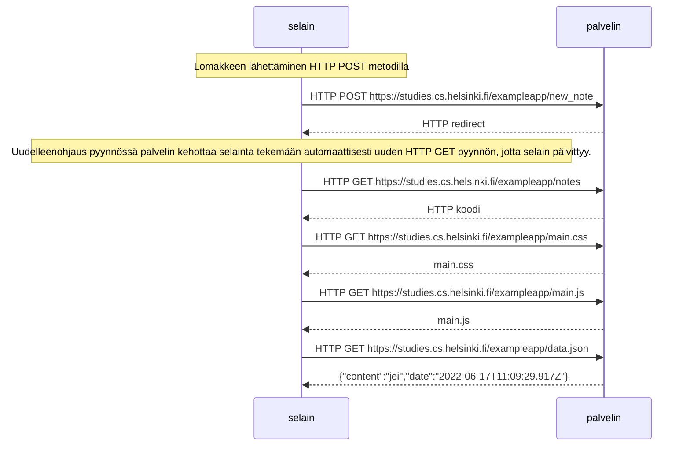

```mermaid
sequenceDiagram
     participant selain
     participant palvelin
     
     Note over selain: Lomakkeen lähettäminen HTTP POST metodilla
     selain->>palvelin: HTTP POST https://studies.cs.helsinki.fi/exampleapp/new_note
     palvelin-->>selain: HTTP redirect
     Note over selain: Uudelleenohjaus pyynnössä palvelin kehottaa selainta tekemään automaattisesti uuden HTTP GET pyynnön, jotta selain päivittyy.
     selain->>palvelin: HTTP GET https://studies.cs.helsinki.fi/exampleapp/notes
     palvelin-->>selain: HTTP koodi
     selain->>palvelin: HTTP GET https://studies.cs.helsinki.fi/exampleapp/main.css
     palvelin-->>selain: main.css
     selain->>palvelin: HTTP GET https://studies.cs.helsinki.fi/exampleapp/main.js
     palvelin-->>selain: main.js
     selain->>palvelin: HTTP GET https://studies.cs.helsinki.fi/exampleapp/data.json
     palvelin-->>selain: {"content":"jei","date":"2022-06-17T11:09:29.917Z"}
     
     
```
