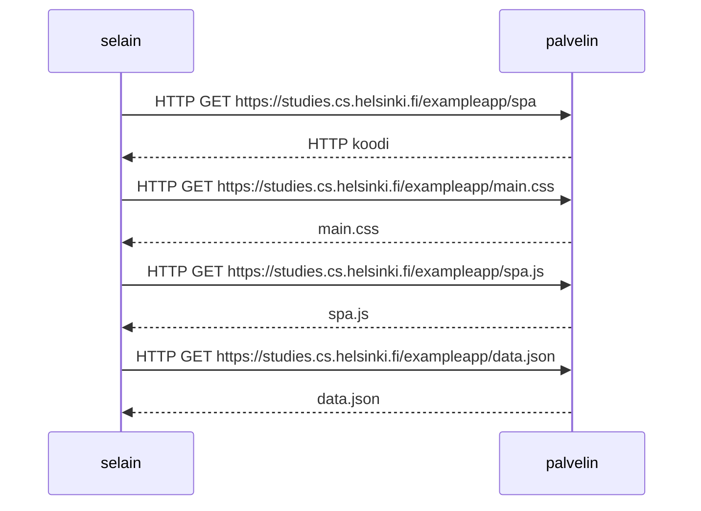

```mermaid
sequenceDiagram
     participant selain
     participant palvelin
     
     
     selain->>palvelin: HTTP GET https://studies.cs.helsinki.fi/exampleapp/spa
     palvelin-->>selain: HTTP koodi
     selain->>palvelin: HTTP GET https://studies.cs.helsinki.fi/exampleapp/main.css
     palvelin-->>selain: main.css
     selain->>palvelin: HTTP GET https://studies.cs.helsinki.fi/exampleapp/spa.js
     palvelin-->>selain: spa.js
     selain->>palvelin: HTTP GET https://studies.cs.helsinki.fi/exampleapp/data.json
     palvelin-->>selain: data.json
     
     
```
